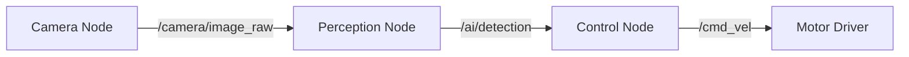

import Tabs from '@theme/Tabs';
import TabItem from '@theme/TabItem';

# 🧠 Module 1: The Robotic Nervous System (ROS 2)

**Focus:** Middleware for real-time robot control.

The **Robot Operating System (ROS 2)** is the industry-standard middleware that acts as the "nervous system" for robots. It allows different parts of a robot (cameras, motors, AI models) to talk to each other.

## Core Concepts

### 1. The Node Architecture

ROS 2 breaks down complex behaviors into small, manageable "Nodes".

*   **Nodes:** Individual processes (e.g., `camera_node`, `motor_node`).
*   **Topics:** Channels for asynchronous data streaming (e.g., video feed).
*   **Services:** Synchronous request/response (e.g., "Pick up this object").



### 2. Developing with `rclpy`

We use Python (`rclpy`) to bridge high-level AI logic with low-level hardware control.

<Tabs>
  <TabItem value="pub" label="Publisher Example" default>

  ```python
  # Minimal ROS 2 Publisher
  import rclpy
  from rclpy.node import Node
  from std_msgs.msg import String

  class MinimalPublisher(Node):
      def __init__(self):
          super().__init__('minimal_publisher')
          self.publisher_ = self.create_publisher(String, 'topic', 10)
          self.timer = self.create_timer(0.5, self.timer_callback)

      def timer_callback(self):
          msg = String()
          msg.data = 'Hello ROS 2!'
          self.publisher_.publish(msg)
  ```

  </TabItem>
  <TabItem value="sub" label="Subscriber Example">

  ```python
  # Minimal ROS 2 Subscriber
  import rclpy
  from rclpy.node import Node
  from std_msgs.msg import String

  class MinimalSubscriber(Node):
      def __init__(self):
          super().__init__('minimal_subscriber')
          self.subscription = self.create_subscription(
              String, 'topic', self.listener_callback, 10)

      def listener_callback(self, msg):
          self.get_logger().info('I heard: "%s"' % msg.data)
  ```

  </TabItem>
</Tabs>

### 3. URDF: Defining the Body

To simulate a robot, we must define its physical structure using **URDF** (Unified Robot Description Format). This XML format tells the physics engine about the robot's joints, links, and mass.

:::tip Key Takeaway
A well-defined URDF is critical for "Sim-to-Real" transfer. If your physical model matches your simulation model, your AI training will transfer successfully.
:::
